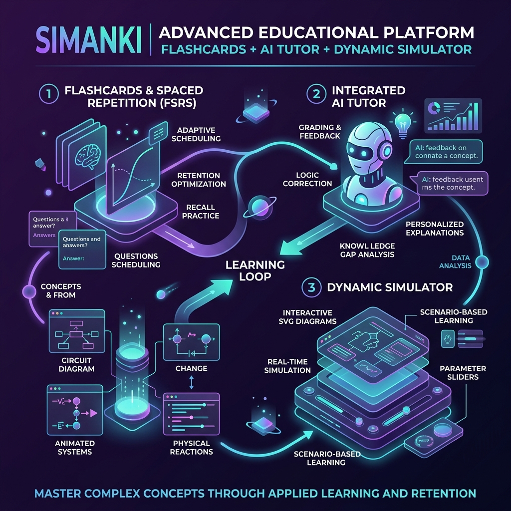

# SimAnki - Next-Generation AI-Powered Spaced Repetition System (SRS)

SimAnki is an advanced, standalone React/Vite educational web application that fuses spaced repetition scheduling with generative AI tutor grading, interactive calculators, decision-based scenarios, and animated visual diagrams. 

It is designed to help students master complex physical, quantitative, and conceptual topics (such as structural engineering, medicine, economics, or system design) by identifying logical gaps and reinforcing correct mental models through interactive practice.

---

## 🎨 System Architecture & Learning Loop



---

## 🚀 Key Features

### 1. Spaced Repetition (FSRS Spacing Engine)
* **How it works:** Uses the state-of-the-art **FSRS** scheduling algorithm (with customized target retention calculations) to optimize memory intervals.
* **Toughness Slider:** Adjust your desired target memory retention rate from 75% to 95% in settings. Setting a higher retention target schedules cards sooner to ensure active recall.
* **Automatic Rating:** No more guessing whether a card was "Hard" or "Good." The app automatically maps the AI tutor's score to FSRS grades (`Again`, `Hard`, `Good`, `Easy`) and updates intervals.

### 2. Integrated AI Tutor & Grading
* **AI Logic Evaluation:** Grades your free-form text explanations (from 0 to 100) based purely on conceptual accuracy—ignoring typing speed and confidence variables.
* **Custom AI Instructions:** A configuration field in Settings allows you to tell the AI how to act (e.g., *"Explain structural concepts using concrete analogies"* or *"End all responses with Beep Boop"*).
* **ELI5 Mode:** If you fail a card 4 or more times, the AI automatically shifts to an **ELI5 (Explain Like I'm 5)** style, explaining the concept with simple terms and child-friendly analogies.
* **History Diagnosis:** The AI grades you while reviewing your last 4 review history logs, telling you if you are repeating the exact same error, corrected it, or made a new mistake.

### 3. Dynamic Interactive Simulations
* **Calculator Mode:** For quantitative concepts (e.g. beam bending stress), the AI generates a live widget with sliders (variables) and formulas, allowing you to manipulate values and see stress limits, stability status, and failure warnings in real-time.
* **Scenario Mode:** For qualitative concepts (e.g. system design choice), the AI designs a multi-stage, choice-based case study adventure with immediate feedback on decisions.
* **Animated SVG Diagrams:** Each simulation embeds an animated SVG diagram styled for a dark background (using native SMIL animations like `<animate>` and `<animateTransform>`) showing concepts in motion.
* **Tactile Sounds & TTS:** Includes a zero-latency Web Audio sound synthesizer (clicks, chimes, fail buzzes) and word-highlighting Text-to-Speech (TTS) that reads explanations aloud and narrates the visual diagrams.

### 4. Full Data Portability
* **No Cloud / Local First:** All your decks, cards, configurations, and detailed card history graphs are saved securely in your browser's local storage.
* **Backup Export/Import:** Export a single JSON file of all decks, cards, and histories to back up your progress or transfer it between devices.

---

## 🛠 Tech Stack

* **Frontend:** React 19, Vite, Vanilla CSS
* **Icons:** Lucide React
* **AI Model:** Google Gemini API (`gemini-2.5-flash` or `gemini-2.5-pro`)
* **Audio Engine:** HTML5 Web Audio API Synthesizer (No external media assets)
* **TTS Voiceover:** Web Speech Synthesis API with word boundary listeners

---

## 🏃 Local Setup & Development

To run SimAnki on your local machine:

1. Clone the repository:
   ```bash
   git clone https://github.com/Happy123455/sim-anki.git
   cd sim-anki
   ```
2. Install dependencies:
   ```bash
   npm install
   ```
3. Run the development server:
   ```bash
   npm run dev
   ```
4. Build for production:
   ```bash
   npm run build
   ```
