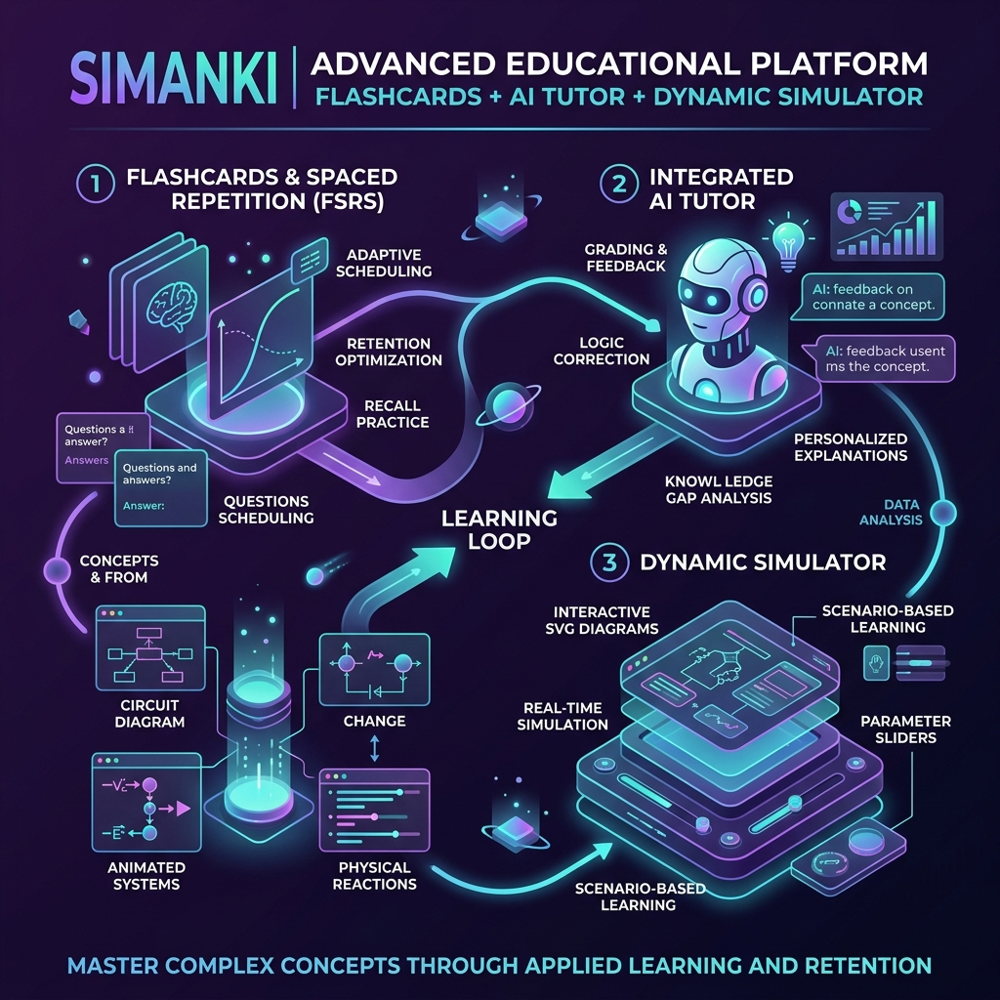

# SimAnki - Next-Generation AI-Powered Spaced Repetition System (SRS)

SimAnki is an advanced, standalone React/Vite educational web application that fuses spaced repetition scheduling with generative AI tutor grading, interactive calculators, decision-based scenarios, and animated visual diagrams. 

It is designed to help students master complex physical, quantitative, and conceptual topics (such as structural engineering, medicine, economics, or system design) by identifying logical gaps and reinforcing correct mental models through interactive practice.

---

## 🎨 System Architecture & Learning Loop



---

## 🚀 Key Features

### 1. Spaced Repetition (FSRS Spacing Engine)
* **How it works:** Uses the state-of-the-art **FSRS** scheduling algorithm (with customized target retention calculations) to optimize memory intervals.
* **Toughness Slider:** Adjust your desired target memory retention rate from 75% to 95% in settings. Setting a higher retention target schedules cards sooner to ensure active recall.
* **Automatic Rating:** No more guessing whether a card was "Hard" or "Good." The app automatically maps the AI tutor's score to FSRS grades (`Again`, `Hard`, `Good`, `Easy`) and updates intervals.

### 2. Integrated AI Tutor & Grading
* **AI Logic Evaluation:** Grades your free-form text explanations (from 0 to 100) based purely on conceptual accuracy—ignoring typing speed and confidence variables.
* **Custom AI Instructions:** A configuration field in Settings allows you to tell the AI how to act (e.g., *"Explain structural concepts using concrete analogies"* or *"End all responses with Beep Boop"*).
* **ELI5 Mode:** If you fail a card 4 or more times, the AI automatically shifts to an **ELI5 (Explain Like I'm 5)** style, explaining the concept with simple terms and child-friendly analogies.
* **History Diagnosis:** The AI grades you while reviewing your last 4 review history logs, telling you if you are repeating the exact same error, corrected it, or made a new mistake.

### 3. Dynamic Interactive Simulations
* **Calculator Mode:** For quantitative concepts (e.g. beam bending stress), the AI generates a live widget with sliders (variables) and formulas, allowing you to manipulate values and see stress limits, stability status, and failure warnings in real-time.
* **Scenario Mode:** For qualitative concepts (e.g. system design choice), the AI designs a multi-stage, choice-based case study adventure with immediate feedback on decisions.
* **Animated SVG Diagrams:** Each simulation embeds an animated SVG diagram styled for a dark background (using native SMIL animations like `<animate>` and `<animateTransform>`) showing concepts in motion.
* **Tactile Sounds & TTS:** Includes a zero-latency Web Audio sound synthesizer (clicks, chimes, fail buzzes) and word-highlighting Text-to-Speech (TTS) that reads explanations aloud and narrates the visual diagrams.

### 4. Full Data Portability
* **No Cloud / Local First:** All your decks, cards, configurations, and detailed card history graphs are saved securely in your browser's local storage.
* **Backup Export/Import:** Export a single JSON file of all decks, cards, and histories to back up your progress or transfer it between devices.

### 5. Autopilot: it adapts so you don't have to tune anything
Autopilot is on by default (Settings → Study). It makes these decisions for you:

* **A memory model fitted to you.** Standard FSRS-6 uses 21 weights fitted to millions of other people's reviews. In a background worker, Autopilot re-fits those weights to *your* history. It checks the fit on your most recent reviews, which the fit never saw. It switches only when the personal weights predict your recall consistently better (a paired test across three time windows). When it switches, it recomputes each card's memory state but keeps today's due dates, so nothing piles up.
* **Fairer grading.** The AI scores correctness. Autopilot also weighs how fast you answered compared with your own usual speed, and your confidence. *Easy* is for quick, sure recall; correct but laboured is *hard*.
* **Reads the session.** Two misses in a row: easier cards come next, AI feedback turns gentler, and near misses (40–49%) count as *hard*. Fast and accurate: harder cards. Long session with slowing answers or falling accuracy: it offers a natural stopping point.
* **Steady workload.** New cards per day follow how much you usually study. Target recall dips to 85–87% while a backlog clears and rises to 92% on light days. Reviews are ordered most-at-risk first, with new cards woven in.

How the memory model was validated (simulated learners, `npm test` and `tests/`):

| Learner | Standard FSRS-6, next 90 days | Autopilot |
| --- | --- | --- |
| Forgets faster than average | real recall 86% (target 90%) | 89.5%, more remembered at the end |
| Remembers better than average | 97% recall, 198 reviews | 98% recall with 19% fewer reviews |
| Average | – | identical (correctly stays on standard) |

It does **not** beat FSRS for everyone: for an average learner the standard weights are already right, and Autopilot leaves them alone. The gain comes from fitting *you*, and it needs a few weeks of reviews (60+ spaced reviews) before it can tell.

### 6. Sync Between Your Devices
Tap **Sync** in the top bar. There are three ways to sync, and none of them overwrite anything: both devices **merge**, keeping every review, new card and deck, and any deletions are carried across.

| Method | Best for | What you need |
| --- | --- | --- |
| **Nearby (code or QR)** | Phone ↔ laptop in seconds | Nothing. On one device tap *Show code*; on the other, tap *Enter code* and type the 6-digit code or scan the QR with the camera, then tap *Allow*. |
| **Sync file** | Offline, AirDrop / Nearby Share / USB | *Send file* on one device, *Merge file* on the other. |
| **Cloud auto-sync** | Hands-off background sync | A GitHub token with `gist` scope (Settings → Sync). |

* **How Nearby works:** data travels directly between the two browsers over WebRTC, on the local network when both are on the same Wi-Fi. A free [PeerJS](https://peerjs.com/) broker is used only to introduce the devices. You can point it at your own PeerJS server under *Settings → Sync → Advanced*.
* **New device setup:** when showing a code you can also share your Gemini API key. It is only used if the other device has none yet.
* **Safety:** the showing device must approve every connection, a scanned link never connects on its own, and a restore point is saved before each merge (*Settings → Data → Backups*).

---

## 🛠 Tech Stack

* **Frontend:** React 19, Vite, Vanilla CSS
* **Icons:** Lucide React
* **AI Model:** Google Gemini API (`gemini-2.5-flash` or `gemini-2.5-pro`)
* **Audio Engine:** HTML5 Web Audio API Synthesizer (No external media assets)
* **TTS Voiceover:** Web Speech Synthesis API with word boundary listeners

---

## 🏃 Local Setup & Development

To run SimAnki on your local machine:

1. Clone the repository:
   ```bash
   git clone https://github.com/Happy123455/sim-anki.git
   cd sim-anki
   ```
2. Install dependencies:
   ```bash
   npm install
   ```
3. Run the development server:
   ```bash
   npm run dev
   ```
4. Build for production:
   ```bash
   npm run build
   ```

## 🌐 Deployment (GitHub Pages)

Every push to `main` is built and published automatically by `.github/workflows/deploy.yml`.

One-time setup: **Settings → Pages → Build and deployment → Source: GitHub Actions**.

If Pages is instead set to serve a branch directly, `index.html` forwards visitors to a prebuilt copy in `live/`. Refresh that copy with `npm run build:live` and commit it whenever the app changes.
